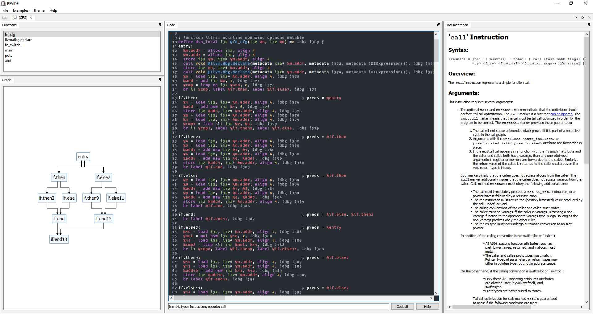

# REVIDE



## Dependencies

CMake downloads missing dependencies by default:

- LLVM 21.1.6 from [LLVMParty/llvm-builds](https://github.com/LLVMParty/llvm-builds)
- Qt 5.12.12 from [x64dbg/deps](https://github.com/x64dbg/deps) on Windows/MSVC builds
- Qt Advanced Docking System through CMake `FetchContent`

Set `REVIDE_DOWNLOAD_DEPENDENCIES=OFF` to require locally installed dependencies. Individual downloads can be controlled with `REVIDE_DOWNLOAD_LLVM`, `REVIDE_DOWNLOAD_QT`, and `REVIDE_DOWNLOAD_QTADS`.

For local installations, set [CMAKE_PREFIX_PATH](https://cmake.org/cmake/help/latest/variable/CMAKE_PREFIX_PATH.html) to the LLVM and Qt prefixes.

On macos you can install dependencies with `brew install llvm qt@6`. You can find prefixes with `brew --prefix llvm` and `brew --prefix qt@6`.

## Building (generic)

```bash
cmake -B build -DCMAKE_BUILD_TYPE=RelWithDebInfo
cmake --build build --parallel --config RelWithDebInfo
```

To use local dependency installs:

```bash
cmake -B build "-DCMAKE_PREFIX_PATH=/path/to/llvm;/path/to/qt" -DREVIDE_DOWNLOAD_DEPENDENCIES=OFF
cmake --build build --parallel --config RelWithDebInfo
```

Quote the `CMAKE_PREFIX_PATH` argument on Unix platforms because `;` is a shell metacharacter.

## Building (macos)

```sh
brew install llvm qt@6
cmake -B build "-DCMAKE_PREFIX_PATH=$(brew --prefix llvm);$(brew --prefix qt@6)" -DREVIDE_DOWNLOAD_DEPENDENCIES=OFF
cmake --build build --parallel
```
